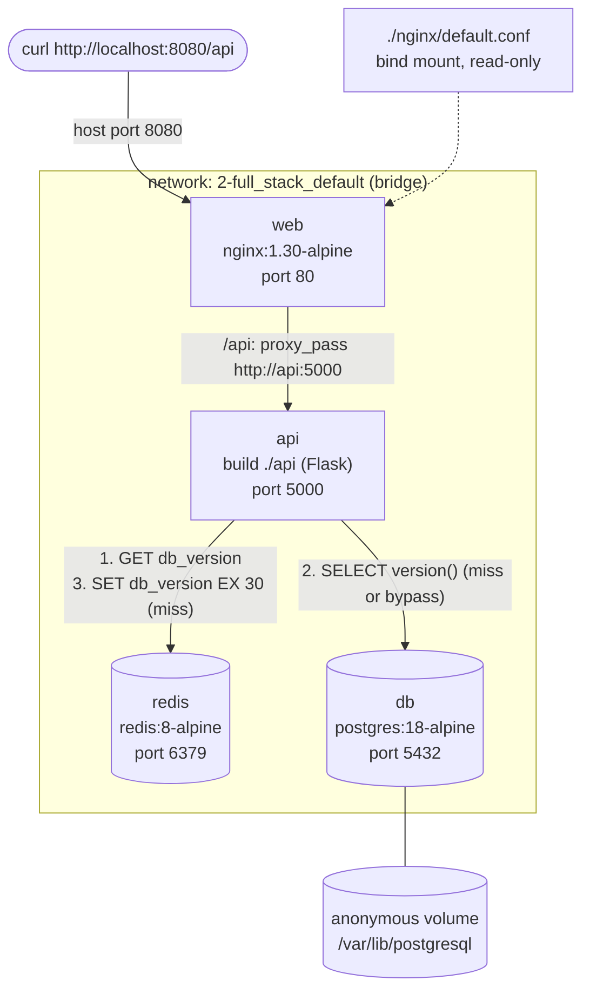

# Architecture of the `2-full_stack` Stack

This document describes the stack in [`2-full_stack`](./2-full_stack). It
is based only on its [`compose.yaml`](./2-full_stack/compose.yaml),
[`nginx/default.conf`](./2-full_stack/nginx/default.conf) and
[`api/`](./2-full_stack/api) code. Names, networks and volumes were
checked on a running stack (Docker Engine 29.7.2, Compose v5.5.0).
IP addresses are assigned at startup and can change from one run to the
next.

## Diagram

```text
  curl http://localhost:8080/api
            │
            │ host port 8080 (the only published port)
┌───────────┼──────────────────────────────────────────────────────────┐
│ network 2-full_stack_default (bridge)                                │
│           ▼                                                          │
│   ┌───────────────┐  nginx:1.30-alpine                               │
│   │ web       :80 │  /     -> nginx welcome page                     │
│   └───────┬───────┘  /api  -> proxy_pass http://api:5000             │
│           │                                                          │
│           ▼                                                          │
│   ┌───────────────┐  1. GET db_version          ┌────────────────┐   │
│   │ api     :5000 │────────────────────────────►│ redis    :6379 │   │
│   │ Flask         │  3. SET db_version EX 30    │ redis:8-alpine │   │
│   └───────┬───────┘     (miss only)             └────────────────┘   │
│           │                                                          │
│           │ 2. SELECT version()  (miss or bypass only)               │
│           ▼                                                          │
│   ┌───────────────┐                                                  │
│   │ db      :5432 │  postgres:18-alpine                              │
│   └───────┬───────┘                                                  │
└───────────┼──────────────────────────────────────────────────────────┘
            ▼
  anonymous volume mounted on /var/lib/postgresql
```



## 1. Services

| Service | Image or build | Role | Internal port | Published port | Depends on (condition) | Healthcheck |
|---|---|---|---|---|---|---|
| `web` | image `nginx:1.30-alpine` | Reverse proxy. Serves the nginx welcome page on `/` and forwards `/api` to `api:5000`. | `80` | `8080` → `80` (`0.0.0.0` and `[::]`) | `api` (`service_started`, short syntax) | none |
| `api` | build `./api` (`python:3.12-slim`, `CMD ["python", "app.py"]`), image `2-full_stack-api` | Flask app. Answers `GET /api` with the Postgres version, read through a Redis cache. | `5000` | none | `db` (`service_healthy`), `redis` (`service_healthy`) | none |
| `db` | image `postgres:18-alpine` | PostgreSQL database `app`, user `app`. | `5432` | none | none | `pg_isready -h localhost -U $${POSTGRES_USER} -d $${POSTGRES_DB}`, every `5s`, timeout `5s`, `5` retries, start period `10s` |
| `redis` | image `redis:8-alpine` | Cache for the `db_version` key, with a 30 s TTL. | `6379` | none | none | `redis-cli ping`, every `5s`, timeout `3s`, `5` retries, start period `5s` |

Environment variables set in `compose.yaml`:

| Service | Variables |
|---|---|
| `api` | `DB_HOST=db`, `DB_NAME=app`, `DB_USER=app`, `DB_PASSWORD=${POSTGRES_PASSWORD}`, `REDIS_HOST=redis`, `REDIS_PORT=6379`, `CACHE_TTL=30` |
| `db` | `POSTGRES_DB=app`, `POSTGRES_USER=app`, `POSTGRES_PASSWORD=${POSTGRES_PASSWORD}` |

`POSTGRES_PASSWORD` comes from the `.env` file next to `compose.yaml`,
which is not committed. Compose refuses to start if it is missing.

Status of the running stack:

```text
$ docker compose ps --format 'table {{.Service}}\t{{.Status}}\t{{.Ports}}'
SERVICE   STATUS                    PORTS
api       Up 31 seconds             5000/tcp
db        Up 36 seconds (healthy)   5432/tcp
redis     Up 36 seconds (healthy)   6379/tcp
web       Up 31 seconds             0.0.0.0:8080->80/tcp, [::]:8080->80/tcp
```

Only `web` has a host mapping. `5000/tcp`, `5432/tcp` and `6379/tcp` are
only reachable inside the network.

## 2. Networks

`compose.yaml` has no `networks:` key, so Compose creates one network
for the project, named `<project>_default`. The project name is the
directory name, `2-full_stack`.

```bash
docker network inspect 2-full_stack_default
```

| Field | Value |
|---|---|
| Name | `2-full_stack_default` |
| Driver / scope | `bridge` / `local` |
| Internal | `false` |
| Subnet / gateway | `172.18.0.0/16` / `172.18.0.1` |
| Labels | `com.docker.compose.network=default`, `com.docker.compose.project=2-full_stack` |

All four containers are attached to it:

| Container | IPv4 (this run) | DNS names on the network |
|---|---|---|
| `2-full_stack-db-1` | `172.18.0.2` | `db`, `2-full_stack-db-1`, short container ID |
| `2-full_stack-redis-1` | `172.18.0.3` | `redis`, `2-full_stack-redis-1`, short container ID |
| `2-full_stack-api-1` | `172.18.0.4` | `api`, `2-full_stack-api-1`, short container ID |
| `2-full_stack-web-1` | `172.18.0.5` | `web`, `2-full_stack-web-1`, short container ID |

### DNS resolution by service name

Each container uses Docker's embedded DNS server:

```text
$ docker compose exec api cat /etc/resolv.conf
nameserver 127.0.0.11
options ndots:0
```

It resolves every service name to the container IP:

```text
$ docker compose exec api getent hosts db redis web api
172.18.0.2      db
172.18.0.3      redis
172.18.0.5      web
172.18.0.4      api
```

The stack relies on these names instead of IPs:

- nginx: `proxy_pass http://api:5000`
- api: `DB_HOST=db` and `REDIS_HOST=redis`

nginx resolves `api` when it loads its configuration. Started alone
(`docker compose up -d --no-deps web`), it exits with code `1`:

```text
nginx: [emerg] host not found in upstream "api" in /etc/nginx/conf.d/default.conf:10
```

That is why `web` depends on `api`.

From the host, only port `8080` is reachable. nginx logs the client as
`192.168.65.1` (the Docker Desktop host gateway), while the API logs
every request as coming from `172.18.0.5`, the `web` container.

## 3. Volumes

`compose.yaml` has no `volumes:` key. The data lives in three different
places:

| Service | Mount | Type | Where the data lives |
|---|---|---|---|
| `db` | `/var/lib/postgresql` | anonymous volume, read-write | Declared by the `postgres:18-alpine` image (`VOLUME /var/lib/postgresql`, `PGDATA=/var/lib/postgresql/18/docker`). |
| `web` | `/etc/nginx/conf.d/default.conf` | bind mount of `./nginx/default.conf`, read-only (`RW=false`, mode `ro`) | The file in the repository. nginx cannot modify it. |
| `redis` | none | container writable layer | `redis:8-alpine` declares no volume. Redis writes RDB snapshots to `/data/dump.rdb` inside the container. |
| `api` | none | image | The code is copied into the image at build time (`COPY app.py .`). |

```text
$ docker volume ls
DRIVER    VOLUME NAME
local     044557cba5f9f8965defa949395e67dc1483d2de0ad0e8c45e6709716e0d3279

$ docker volume inspect -f 'Driver={{.Driver}}
Mountpoint={{.Mountpoint}}
Labels={{json .Labels}}' 044557cba5f9…
Driver=local
Mountpoint=/var/lib/docker/volumes/044557cba5f9…/_data
Labels={"com.docker.volume.anonymous":""}
```

The mount point is inside the Docker Desktop virtual machine, not
directly on the macOS file system.

Redis persistence settings (image defaults, no config file):

```text
$ docker compose exec redis redis-cli CONFIG GET save
save
3600 1 300 100 60 10000
$ docker compose exec redis redis-cli CONFIG GET appendonly
appendonly
no
$ docker compose exec redis redis-cli CONFIG GET dir
dir
/data
```

So Redis saves RDB snapshots, but only inside the container.

What survives, as tested on the running stack:

| Action | Postgres data | Redis data |
|---|---|---|
| `docker compose restart redis` | not affected | kept: a test key was still there, and `/data/dump.rdb` exists |
| `docker compose down`, then `up` | lost for the new container: `down` keeps the anonymous volume, but `up` mounts a new one (`044557cba5f9…` became `4b7bd6126951…`), leaving the old one dangling | lost: the test key was gone |
| `docker compose down -v` | anonymous volume removed | removed with the container |

## 4. Path of a request

`curl http://localhost:8080/api`, common part:

1. Docker forwards host port `8080` to port `80` of the `web` container.
2. nginx matches `location /api` and runs `proxy_pass http://api:5000`.
   Since `proxy_pass` has no URI part, the path `/api` is forwarded
   unchanged. nginx adds `Host`, `X-Real-IP`, `X-Forwarded-For` and
   `X-Forwarded-Proto`.
3. Flask runs the `/api` route, which calls `get_db_version_cached()`.

### Cache hit

4. The API runs `GET db_version` on Redis and gets a value.
5. It logs `Cache hit for db_version` and returns
   `{"cache":"hit","db_version":"…","message":"Hello from the API!"}`
   with HTTP `200`. Postgres is not contacted.

### Cache miss

4. `GET db_version` returns nothing.
5. The API opens a new connection to `db:5432` (database `app`, user
   `app`, `connect_timeout=3`), runs `SELECT version()` and closes the
   connection.
6. It runs `SET db_version <value> EX 30` on Redis, logs
   `Cache miss for db_version, stored for 30s` and returns
   `{"cache":"miss",…}` with HTTP `200`.

Redis commands seen with `redis-cli MONITOR` during a miss followed by a
hit (value shortened):

```text
1790353339.051797 [0 172.18.0.4:60108] "GET" "db_version"
1790353339.060343 [0 172.18.0.4:60108] "SET" "db_version" "PostgreSQL 18.6 on aarch64-unknown-linux-musl, …" "EX" "30"
1790353339.087057 [0 172.18.0.4:60108] "GET" "db_version"
```

The three commands use the same client connection
(`172.18.0.4:60108`): the Redis client keeps a connection pool, while
Postgres gets a new connection on each miss.

### Bypass: Redis is down

4. Any `redis.RedisError` during `GET` or `SET` (connection refused,
   unknown host, 2 s timeout) is caught. The API logs
   `Redis unavailable, skipping the cache: …`.
5. It runs `SELECT version()` on Postgres directly and returns
   `{"cache":"bypass",…}` with HTTP `200`.

If `SET` fails after a miss, Postgres is queried a second time in the
bypass branch.

With `redis` stopped:

```text
{"cache":"bypass","db_version":"…","message":"Hello from the API!"} HTTP 200
WARNING Redis unavailable, skipping the cache: Error -2 connecting to redis:6379. Name or service not known.
```

### Postgres is down

On a miss or a bypass, `psycopg.OperationalError` is caught by the
route, which returns HTTP `503`:

```text
{"error":"Database is unavailable, try again in a few seconds.","message":"Hello from the API!"} HTTP 503
WARNING Database unavailable: failed to resolve host 'db': [Errno -2] Name or service not known
```

On a hit, Postgres is not contacted, so the API still answers `200`
while the key is cached.

### Return path

Flask returns the JSON to nginx, and nginx returns it to `curl`. Both
log the request:

```text
web-1  | 192.168.65.1 - - [25/Sep/2026:16:22:19 +0000] "GET /api HTTP/1.1" 200 158 "-" "curl/8.7.1" "-"
api-1  | INFO 172.18.0.5 - - [25/Sep/2026 16:22:19] "GET /api HTTP/1.1" 200 -
```

## 5. Start order

1. `db` and `redis` have no dependencies, so they start first, in
   parallel.
2. Their healthchecks run inside each container:
   - `db`: `pg_isready -h localhost -U $POSTGRES_USER -d $POSTGRES_DB`.
     `-h localhost` checks TCP, not the Unix socket that the image's
     temporary initialisation server uses.
   - `redis`: `redis-cli ping`.

   The first check runs one `interval` (5 s) after the container starts.
3. `api` uses `condition: service_healthy` for both. Compose waits until
   `db` and `redis` are `healthy` before it creates and starts `api`.
4. At startup, the API runs `SELECT version()` and `PING` once, without
   retry. It logs `Connected to database: …` and `Connected to Redis`,
   or exits with code `1`. Then it listens on `0.0.0.0:5000`.
5. `web` depends on `api` with the short syntax (`service_started`).
   `api` has no healthcheck, so `web` starts as soon as the `api`
   container has started, not when Flask is listening. During that
   short window, nginx can answer `502 Bad Gateway` (seen in
   [`0-first_stack`](./0-first_stack)).

Real `docker compose up -d` output:

```text
 Container 2-full_stack-db-1 Started
 Container 2-full_stack-redis-1 Started
 Container 2-full_stack-redis-1 Waiting
 Container 2-full_stack-db-1 Waiting
 Container 2-full_stack-redis-1 Healthy
 Container 2-full_stack-db-1 Healthy
 Container 2-full_stack-api-1 Started
 Container 2-full_stack-web-1 Started
```

`depends_on` is only checked when the stack starts. After that, the
health status is informative: no service has a `restart` policy, so
Docker does not restart a container that becomes `unhealthy`.
